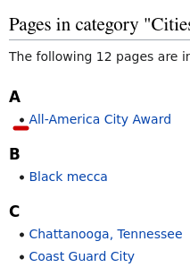

# wiki_cat_parcer
functions for parsing wikipedia pages of categoryes types.
You can get a dictionary wich contains {"text of link":"url behind the link"}.

We will show on page https://en.wikipedia.org/wiki/Category:Cities_in_the_United_States


```python
from wiki_cat_parser import *
import pandas as pd
```

## Read subcategoryes

Sub categoryes has a triangle marker close to them:


```python
pg_parsing_result = read_wiki_subcats(
    "https://en.wikipedia.org/wiki/Category:Cities_in_the_United_States")

pd.DataFrame({'url':pg_parsing_result.values()}, 
             index = pg_parsing_result.keys())
```


<div>
<style scoped>
    .dataframe tbody tr th:only-of-type {
        vertical-align: middle;
    }

    .dataframe tbody tr th {
        vertical-align: top;
    }

    .dataframe thead th {
        text-align: right;
    }
</style>
<table border="1" class="dataframe">
  <thead>
    <tr style="text-align: right;">
      <th></th>
      <th>url</th>
    </tr>
  </thead>
  <tbody>
    <tr>
      <th>Cities in the United States by county</th>
      <td>/wiki/Category:Cities_in_the_United_States_by_...</td>
    </tr>
    <tr>
      <th>Cities in the United States by metropolitan area</th>
      <td>/wiki/Category:Cities_in_the_United_States_by_...</td>
    </tr>
    <tr>
      <th>Cities in the United States by state</th>
      <td>/wiki/Category:Cities_in_the_United_States_by_...</td>
    </tr>
    <tr>
      <th>Lists by city in the United States</th>
      <td>/wiki/Category:Lists_by_city_in_the_United_States</td>
    </tr>
    <tr>
      <th>Lists of cities in the United States</th>
      <td>/wiki/Category:Lists_of_cities_in_the_United_S...</td>
    </tr>
    <tr>
      <th>Cities of Appalachia</th>
      <td>/wiki/Category:Cities_of_Appalachia</td>
    </tr>
    <tr>
      <th>Capitals of political divisions in the United States</th>
      <td>/wiki/Category:Capitals_of_political_divisions...</td>
    </tr>
    <tr>
      <th>Categories by city in the United States</th>
      <td>/wiki/Category:Categories_by_city_in_the_Unite...</td>
    </tr>
    <tr>
      <th>Consolidated city-counties</th>
      <td>/wiki/Category:Consolidated_city-counties</td>
    </tr>
    <tr>
      <th>Independent cities in the United States</th>
      <td>/wiki/Category:Independent_cities_in_the_Unite...</td>
    </tr>
    <tr>
      <th>Majority-minority cities and towns in the United States</th>
      <td>/wiki/Category:Majority-minority_cities_and_to...</td>
    </tr>
    <tr>
      <th>Cities in the Mojave Desert</th>
      <td>/wiki/Category:Cities_in_the_Mojave_Desert</td>
    </tr>
    <tr>
      <th>Planned cities in the United States</th>
      <td>/wiki/Category:Planned_cities_in_the_United_St...</td>
    </tr>
    <tr>
      <th>Pre-historic cities in the United States</th>
      <td>/wiki/Category:Pre-historic_cities_in_the_Unit...</td>
    </tr>
    <tr>
      <th>Urban decay in the United States</th>
      <td>/wiki/Category:Urban_decay_in_the_United_States</td>
    </tr>
    <tr>
      <th>Urban politics in the United States</th>
      <td>/wiki/Category:Urban_politics_in_the_United_St...</td>
    </tr>
    <tr>
      <th>Works about cities in the United States</th>
      <td>/wiki/Category:Works_about_cities_in_the_Unite...</td>
    </tr>
    <tr>
      <th>Images of cities in the United States</th>
      <td>/wiki/Category:Images_of_cities_in_the_United_...</td>
    </tr>
  </tbody>
</table>
</div>


## Read categoryes pages

Categories has circle marker close to them:




```python
read_wiki_cats(
    "https://en.wikipedia.org/wiki/Category:Cities_in_the_United_States")
pd.DataFrame({'url':pg_parsing_result.values()}, 
             index = pg_parsing_result.keys())
```


<div>
<style scoped>
    .dataframe tbody tr th:only-of-type {
        vertical-align: middle;
    }

    .dataframe tbody tr th {
        vertical-align: top;
    }

    .dataframe thead th {
        text-align: right;
    }
</style>
<table border="1" class="dataframe">
  <thead>
    <tr style="text-align: right;">
      <th></th>
      <th>url</th>
    </tr>
  </thead>
  <tbody>
    <tr>
      <th>Cities in the United States by county</th>
      <td>/wiki/Category:Cities_in_the_United_States_by_...</td>
    </tr>
    <tr>
      <th>Cities in the United States by metropolitan area</th>
      <td>/wiki/Category:Cities_in_the_United_States_by_...</td>
    </tr>
    <tr>
      <th>Cities in the United States by state</th>
      <td>/wiki/Category:Cities_in_the_United_States_by_...</td>
    </tr>
    <tr>
      <th>Lists by city in the United States</th>
      <td>/wiki/Category:Lists_by_city_in_the_United_States</td>
    </tr>
    <tr>
      <th>Lists of cities in the United States</th>
      <td>/wiki/Category:Lists_of_cities_in_the_United_S...</td>
    </tr>
    <tr>
      <th>Cities of Appalachia</th>
      <td>/wiki/Category:Cities_of_Appalachia</td>
    </tr>
    <tr>
      <th>Capitals of political divisions in the United States</th>
      <td>/wiki/Category:Capitals_of_political_divisions...</td>
    </tr>
    <tr>
      <th>Categories by city in the United States</th>
      <td>/wiki/Category:Categories_by_city_in_the_Unite...</td>
    </tr>
    <tr>
      <th>Consolidated city-counties</th>
      <td>/wiki/Category:Consolidated_city-counties</td>
    </tr>
    <tr>
      <th>Independent cities in the United States</th>
      <td>/wiki/Category:Independent_cities_in_the_Unite...</td>
    </tr>
    <tr>
      <th>Majority-minority cities and towns in the United States</th>
      <td>/wiki/Category:Majority-minority_cities_and_to...</td>
    </tr>
    <tr>
      <th>Cities in the Mojave Desert</th>
      <td>/wiki/Category:Cities_in_the_Mojave_Desert</td>
    </tr>
    <tr>
      <th>Planned cities in the United States</th>
      <td>/wiki/Category:Planned_cities_in_the_United_St...</td>
    </tr>
    <tr>
      <th>Pre-historic cities in the United States</th>
      <td>/wiki/Category:Pre-historic_cities_in_the_Unit...</td>
    </tr>
    <tr>
      <th>Urban decay in the United States</th>
      <td>/wiki/Category:Urban_decay_in_the_United_States</td>
    </tr>
    <tr>
      <th>Urban politics in the United States</th>
      <td>/wiki/Category:Urban_politics_in_the_United_St...</td>
    </tr>
    <tr>
      <th>Works about cities in the United States</th>
      <td>/wiki/Category:Works_about_cities_in_the_Unite...</td>
    </tr>
    <tr>
      <th>Images of cities in the United States</th>
      <td>/wiki/Category:Images_of_cities_in_the_United_...</td>
    </tr>
  </tbody>
</table>
</div>